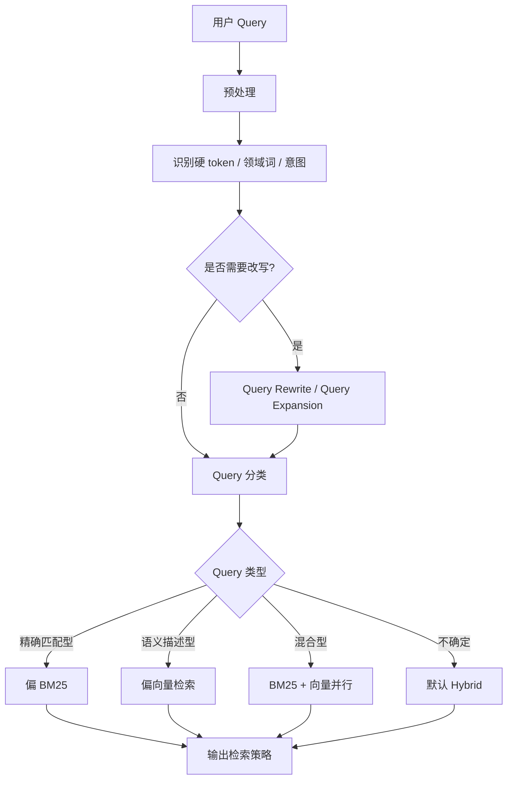
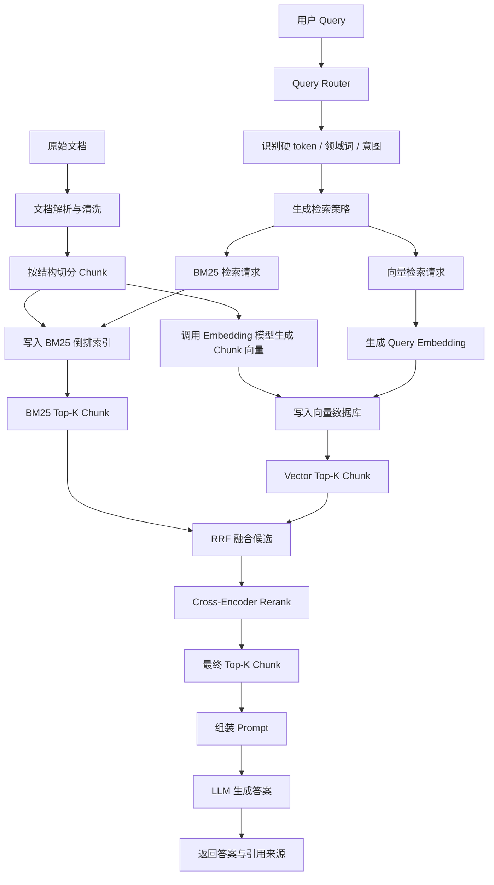

# RAG 混合检索：BM25、Embedding 检索、RRF 与 Cross-Encoder Rerank

在企业知识库、售后工单、代码文档和内部系统问答中，检索链路不能只依赖一种召回方式。**BM25** 擅长精确字面匹配，**Embedding 向量检索**擅长语义相似匹配，**RRF** 负责把不同召回通道的结果按排名融合，**Cross-Encoder Rerank** 负责对融合后的候选 Chunk 做最终精排。

这篇文档聚焦一个核心问题：**BM25 和向量检索不是二选一，而是要按 Query 类型协同工作。**

对于 `error_code=E1234`、`CreateOrderV2`、`OPS-Sentinel`、`iPhone 15 Pro Max` 这类硬 token，关键词检索必须参与。

对于“用户支付失败后怎么排查”这类自然语言描述，Embedding 向量检索更有优势。生产级 RAG 通常会把两路召回合并，再通过 Rerank 控制最终进入 LLM 的证据质量。

---

## 1. 检索方式的核心分类

### 1.1 稀疏检索：以 BM25 为代表的关键词召回

**稀疏检索（Sparse Retrieval）**指基于词项、倒排索引和关键词权重进行召回的检索方式。它之所以叫“稀疏”，是因为系统会把文本映射到一个很大的词表空间中，而一段文本只会命中其中很少一部分词项，大多数位置都可以理解为 0。工程上通常不会真的保存一个巨大的稀疏数组，而是使用**倒排索引**记录“某个词出现在哪些文档或 Chunk 中”。

稀疏检索的代表技术是 **BM25**，下文会在 [第 2 节：BM25：关键词精确匹配的主力](#2-bm25关键词精确匹配的主力) 中详细解释它的公式、分词方式、工作原理和适用场景。

它最适合处理错误码、订单号、型号、API 名、版本号、法规条款、配置项和企业内部专有名词。原因很直接：这些信息的**字面形式就是身份**，差一个字符就可能代表完全不同的对象。

举例来说，用户问 `E1234 支付失败怎么处理？`，BM25 会明确区分 `E1234` 和 `E1243`。只要文档中出现了 `E1234`，它就能通过倒排索引快速命中；如果文档只出现 `E1243`，即使两个字符串看起来很像，也不会因为“长得像”而被当成同一个错误码。

### 1.2 稠密检索：以 Embedding 向量检索为代表的语义召回

**稠密检索（Dense Retrieval）**指基于 Embedding 向量进行语义相似度召回的检索方式。它之所以叫“稠密”，是因为一段文本会被模型编码成一个固定维度的连续向量，向量中的大多数维度都有数值，而不是像稀疏表示那样大面积为 0。

稠密检索的代表技术是 **Embedding 向量检索**，下文会在 [第 3 节：Embedding 向量检索：语义召回的主力](#3-embedding-向量检索语义召回的主力) 中详细解释。

它最适合处理自然语言问题、长文本描述、同义改写和症状描述。例如“用户付款后订单没生成”和“支付成功但订单创建失败”字面不完全一致，但语义上高度相关，向量检索通常能把它们匹配到一起。

稠密检索的优势是语义泛化，缺点是对低频专有名词和硬 token 不够稳定。通用 Embedding 模型可能不知道企业内部的 `飞翼平台`、`OPS-Sentinel`、`CreateOrderV2` 分别代表什么，也不会天然保证 `E1234` 必须匹配包含 `E1234` 的文档。

### 1.3 混合检索：让关键词和语义各自发挥优势

**混合检索（Hybrid Search）**不是简单地把 BM25 分数和向量分数相加，而是让两类检索信号在同一条链路中互补。BM25 负责保证精确 token 不漏召回，Embedding 向量检索负责补充语义相关候选，RRF 负责对不同通道的排名进行融合，Cross-Encoder Rerank 再对候选 Chunk 做精排。

一个典型的混合检索链路可以概括为：用户 Query 进入 Query Router，系统判断它更偏硬 token 还是自然语言语义，然后分别请求 BM25 索引和向量索引得到候选 Chunk；候选 Chunk 经过 RRF 融合后形成统一候选池，再送入 Cross-Encoder Rerank 重新排序，最终只取少量高相关 Chunk 进入 LLM Prompt。

---

## 2. BM25：关键词精确匹配的主力

BM25 是经典的关键词检索算法。它不是简单统计“某个词出现了几次”，而是同时考虑**词频**、**逆文档频率**和**文档长度归一化**。

**词频**表示查询词在文档中出现的次数。**逆文档频率**表示这个词在整个语料中有多稀有，越稀有越有区分度。**文档长度归一化**用于避免长文档因为词多而天然获得更高分。

在真正计算 BM25 之前，系统会先做**分词**。分词的目标是把 Query 和 Chunk 都切成可统计的词项，也就是 BM25 公式里的 `q_i`。

中文场景下，分词通常依赖 Elasticsearch IK、jieba、HanLP、Lucene SmartCN 或自定义词典。英文场景下，分词通常会按空格、标点、大小写规范化、词干还原或词形归一化处理。

例如用户 Query 是：

```text
E1234 支付失败怎么处理？
```

一个适合售后场景的分词结果可能是：

```text
[E1234, 支付失败, 支付, 失败, 处理]
```

这里最关键的是 `E1234` 不能被错误切碎，也不能被当成普通噪声词丢掉。对于错误码、订单号、API 名、配置项、版本号这类硬 token，生产系统通常会用正则和领域词典保护它们，让它们作为完整词项进入 BM25。

如果分词器把 `CreateOrderV2` 切成 `Create`、`Order`、`V2`，或者把 `OPS-Sentinel` 切丢了 `Sentinel`，BM25 后面的公式再正确也会召回不稳。因此 BM25 的工程效果不只取决于公式，也取决于**分词器、停用词表、同义词表和领域词典**。

BM25 的常见公式如下：

$$
score(D,Q)=\sum_{q_i \in Q} IDF(q_i) \cdot \frac{f(q_i,D)\cdot(k_1+1)}{f(q_i,D)+k_1\cdot(1-b+b\cdot\frac{|D|}{avgdl})}
$$

其中，`D` 表示文档或 Chunk，`Q` 表示用户 Query，`q_i` 表示 Query 分词后的某个词项。

`f(q_i,D)` 表示这个词项在文档中出现的次数，`IDF(q_i)` 表示这个词项的稀有程度，`|D|` 表示当前文档长度，`avgdl` 表示语料库中文档的平均长度。

`k1` 控制词频增长的饱和速度，`b` 控制文档长度归一化强度。

从直觉上看，BM25 做了三件事：Query 里的词在文档里出现，文档就应该加分；一个词如果在全库里很少见，它比“的、是、怎么”这类常见词更重要；长文档不能因为内容多、碰巧命中更多词就无条件占优势。

下面用一个售后工单场景说明。用户 Query 是：

```text
E1234 支付失败怎么处理？
```

候选 Chunk 如下：

| Chunk | 内容                                                         |
| ----- | ------------------------------------------------------------ |
| A     | 错误码 E1234 表示支付渠道超时，请检查第三方支付网关，并按重复扣款流程核验。 |
| B     | 错误码 E1243 表示库存锁定失败，请检查库存服务和库存回滚日志。 |
| C     | 支付失败可能由网络异常、余额不足、渠道超时或风控拒绝导致。   |

BM25 会认为 Chunk A 同时命中 `E1234`、`支付失败` 和 `处理` 相关词，其中 `E1234` 由于在全库中非常稀有，会带来很强的区分度。Chunk C 虽然语义上和支付失败有关，但没有命中 `E1234`；Chunk B 虽然同样是错误码文档，却命中的是 `E1243`，不能替代 `E1234`。因此在这类 Query 中，BM25 的精确匹配优势非常明显。

BM25 特别适合错误码、订单号、产品型号、API 名、函数名、版本号、法规条款、SKU、配置项和内部系统代号。它的工程优势也很明确：不需要训练数据，不需要 GPU，基于 Elasticsearch、OpenSearch、Lucene 等系统即可落地；命中哪个词、贡献了多少分也更容易通过日志解释。

---

## 3. Embedding 向量检索：语义召回的主力

Embedding 向量检索会先用 Embedding 模型把 Query 和 Chunk 分别编码成向量，再计算向量之间的相似度。语义越接近的文本，向量空间中的距离通常越近。常见相似度计算方式包括**余弦相似度**、**点积**和**欧氏距离**，实际使用哪一种取决于模型训练方式和向量数据库配置。

以自然语言问题为例，用户 Query 是：

```text
用户付款后订单没生成，应该怎么排查？
```

知识库中可能没有完全相同的句子，但有一个 Chunk 写着：

```text
支付成功但订单创建失败时，需要依次检查支付回调、订单服务幂等表和消息队列消费状态。
```

BM25 可能只命中“支付”或“订单”等普通词，排序不一定靠前；Embedding 向量检索则能理解“付款后订单没生成”和“支付成功但订单创建失败”语义接近，因此更容易召回正确文档。

但对 `E1234`、`E1243`、`CreateOrderV2` 这类字符串，Embedding 模型的可靠性会下降。原因可以合并理解为：这类字符串语义信息很少，通用训练语料覆盖不足，分词结果又可能被切成多个子 token；而向量相似度本质上是软匹配，不会天然保证“必须包含这个精确字符串”。因此 `E1234` 和 `E1243` 在业务上完全不同，但在纯向量空间中可能被认为形式相近，导致召回错误 Chunk。

对企业内部低频专有名词也类似。`飞翼平台`、`OPS-Sentinel`、`星河工单系统` 这类词对企业内部人员很明确，但通用 Embedding 模型未必学过它们的业务含义。用户问“飞翼平台怎么申请权限”，纯向量检索可能召回其他平台的权限文档；BM25 则能直接锁定包含“飞翼平台”的 Chunk。所以在企业 RAG 中，Embedding 检索负责语义泛化，BM25 负责精确约束，两者缺一不可。

---

## 4. Hybrid 融合：Query Router、RRF 与动态权重

Hybrid 的第一步不是融合分数，而是判断 Query 类型。**Query Router** 是一个查询路由模块，用来判断当前 Query 更依赖关键词还是语义。

Query Router 不一定要用大模型。生产系统里更常见的做法是先用规则、正则表达式、领域词典和少量统计特征实现一个轻量 Router。只有当 Query 很复杂、规则无法判断时，才考虑引入小模型或 LLM 做二级分类。

### 4.1 Query Router 如何实现

Query Router 的输入通常是原始 Query、用户所属业务线、知识库 ID、会话上下文和权限过滤条件。它的输出不是最终答案，而是一份**检索策略**，例如走 BM25 还是向量检索、两路分别取多少 Top-K、是否需要 Query Rewrite、是否要保护精确 token。

这部分不需要做得特别复杂。工程上可以先用规则实现一个稳定版本，再根据 bad case 决定是否引入 LLM 分类。



一个简单 Router 可以按下面流程实现。

**第一步：预处理 Query。** 这一步做大小写归一化、全角半角转换、空格清洗和无意义标点清理，但不能破坏关键符号。`E1234`、`ORD-20260503-7788`、`CreateOrderV2`、`max_retry_count` 里的大小写、连字符和下划线都应该保留。

**第二步：识别强规则信号。** 如果 Query 命中错误码、订单号、版本号、SKU、API 名、配置项、文件路径、URL、法规条款编号，就可以认为它有强关键词约束。这类 Query 必须让 BM25 参与。

**第三步：识别语义信号。** 如果 Query 是完整自然语言问题，包含“为什么、怎么、如何、怎么排查、有什么区别”等问法，或者是一整段工单描述，就说明它需要语义召回。这类 Query 必须让向量检索参与。

**第四步：判断是否需要 Query Rewrite。** 如果 Query 太口语化、指代不清或依赖上下文，例如“这个报错怎么处理”，就应该结合会话上下文改写成更完整的 Query。如果 Query 很短但同义表达很多，例如“重复扣款”，可以做 Query Expansion，补充“重复支付、重复扣费、支付流水核验、退款工单”等同义词或相关术语。

**第五步：输出检索策略。** Router 最终只需要给出可执行策略，不需要给出答案。策略可以包括 `bm25_top_k`、`vector_top_k`、是否使用 RRF、是否进入 Rerank、是否保护某些 token。

关于 `lexical_score` 和 `semantic_score`，它们不是必须存在的模型分数，也不是让 LLM 随便打一个分。更常见的做法是规则加权，便于调试。

**lexical_score 可以理解为“字面精确匹配分”。** 它衡量当前 Query 有多依赖关键词、编号、代码、错误码、产品型号、字段名、法规条款这类精确字面信息。这个分数越高，越说明 BM25 不能缺席。

**semantic_score 可以理解为“语义理解分”。** 它衡量当前 Query 有多依赖自然语言理解、同义表达、问题意图、上下文描述和推理型检索。这个分数越高，越说明向量检索不能缺席。

规则加权可以从简单版本开始。比如命中一个错误码，`lexical_score += 3`；命中订单号、SKU、版本号、法规条款，`lexical_score += 3`；命中 API 名、函数名、配置项，`lexical_score += 2`；命中领域词典里的内部系统名或产品名，`lexical_score += 2`。

语义侧也可以类似处理。如果 Query 是完整问句，`semantic_score += 2`；如果包含“怎么排查、为什么、如何处理、有什么区别、能不能”这类意图词，`semantic_score += 2`；如果 Query 是一段较长的工单描述，`semantic_score += 2`；如果命中了同义词扩展词表，`semantic_score += 1`。

一个简单判断策略如下：

| 判断条件 | 路由结果 | 示例 |
|---|---|---|
| `lexical_score >= 3` 且 `semantic_score < 2` | 偏 BM25 | `E1234 是什么意思？` |
| `semantic_score >= 3` 且 `lexical_score < 2` | 偏向量检索 | `用户付款后订单没生成怎么排查？` |
| `lexical_score >= 3` 且 `semantic_score >= 2` | 强 Hybrid | `E1234 支付失败后重复扣款怎么办？` |
| 两个分数都低 | 默认 Hybrid | `退款失败` |
| 两个分数接近但 Query 很复杂 | LLM 兜底分类 | `客户说昨天付了两次钱但订单状态还是失败，这种算什么问题？` |

这些阈值不是标准答案，而是初始配置。上线后应该根据 bad case 调整，例如错误码漏召回多，就降低 BM25 触发门槛；自然语言问题召回不准，就提高向量侧参与度。

当然，也可以直接用 LLM 做 Query 分类。LLM Router 的优点是能理解复杂语义、多意图问题和上下文省略，缺点是成本更高、延迟更高、结果稳定性不如规则，并且需要对输出做 JSON schema 约束。

更稳的做法是**规则优先，LLM 兜底**。以下情况适合触发 LLM 兜底：规则分数接近、Query 同时包含多个意图、Query 依赖上下文指代、用户输入是一整段工单描述、Query 需要先改写才能检索，或者规则命中了很多信号但互相冲突。

LLM 兜底不是让模型直接回答问题，而是让模型只做**分类和改写**。它应该输出固定 JSON，字段包括 Query 类型、是否需要改写、改写后的 Query、需要保护的硬 token、BM25 Top-K、Vector Top-K、是否使用 RRF、是否使用 Rerank。

LLM 兜底还要有安全策略。只要 Query 中存在错误码、订单号、API 名、版本号等硬 token，即使 LLM 判断为语义型，也不能关闭 BM25；最多只能调整两路 Top-K。LLM 不能删除硬 token，不能把 `E1234` 改写成 `E1243`，也不能凭空扩展不存在的业务实体。

LLM 分类可以要求输出固定 JSON，例如：

```json
{
  "query_type": "hybrid",
  "need_rewrite": true,
  "rewrite_query": "E1234 支付渠道超时导致重复扣款时如何处理？",
  "route": {
    "bm25_top_k": 50,
    "vector_top_k": 50,
    "use_rrf": true,
    "use_rerank": true
  },
  "preserve_tokens": ["E1234"]
}
```

不同情况可以按下面方式处理：

| Query 类型 | 示例 | 推荐处理 |
|---|---|---|
| 精确匹配型 | `E1234 是什么意思？` | 偏 BM25，保护 `E1234`，向量少量补充 |
| 语义描述型 | `用户付款后订单没生成怎么排查？` | 偏向量检索，BM25 少量补充关键词候选 |
| 混合型 | `E1234 支付失败后重复扣款怎么办？` | BM25 和向量都取较大 Top-K，再 RRF + Rerank |
| 代码/API 型 | `CreateOrderV2 timeout 怎么处理？` | 偏 BM25，保护 API 名，同时召回语义排查文档 |
| 上下文省略型 | `这个报错怎么处理？` | 先 Query Rewrite，再 Hybrid 检索 |
| 同义词扩展型 | `重复扣款` | Query Expansion 后再 Hybrid 检索 |
| 不确定型 | `退款失败` | 默认 Hybrid，后续依赖 RRF 和 Rerank 兜底 |

Router 的目标不是一次分类永远正确，而是避免明显错误。错误码类 Query 不能被纯向量检索带偏，自然语言问题也不能只靠关键词硬匹配。只要 Router 能把大部分 Query 分到合理通道，后面的 RRF 和 Rerank 就会轻松很多。

### 4.2 为什么不能直接相加分数

常见错误写法是：

$$
final\_score=0.5\times bm25\_score+0.5\times vector\_score
$$

这个公式的问题在于，BM25 分数和向量相似度不是同一种度量。BM25 分数没有固定上限，会随着词频、IDF、文档长度和语料分布变化；余弦相似度通常落在较窄区间，例如 0.7 到 0.95。直接相加时，BM25 数值可能天然压过向量分数，导致语义检索结果几乎不参与排序。

举例来说，Chunk A 的 BM25 分数是 18.0，向量相似度是 0.60；Chunk B 的 BM25 分数是 2.0，向量相似度是 0.92。直接按 0.5 加权后，A 的融合分是 9.30，B 的融合分是 1.46。虽然 B 在语义上更匹配，但因为 BM25 原始数值更大，最终被压下去了。

归一化加权并不是不能用，但要谨慎。Min-Max 归一化和 Z-score 标准化可以把分数映射到相近范围，但它们会受到异常值、Query 分布变化和语料变化影响。更稳妥的起步方式是先用 RRF，只看每个通道内部的排名，不直接比较不同通道的原始分数。

### 4.3 RRF 的原理和完整排名示例

**RRF（Reciprocal Rank Fusion，倒数排名融合）**是一种按排名融合多路检索结果的方法。它不关心 BM25 分数是多少，也不关心向量相似度是多少，只关心某个 Chunk 在每一路检索结果中排第几。排名越靠前，贡献越大；同一个 Chunk 如果在多路检索中都靠前，总分会自然升高。

RRF 的标准公式如下：

$$
RRF(d)=\sum_{i=1}^{n}\frac{1}{c+rank_i(d)}
$$

其中，`d` 表示候选 Chunk，`n` 表示检索通道数量，`rank_i(d)` 表示 Chunk `d` 在第 `i` 个检索通道中的排名，`c` 是平滑常数，常见取值为 60。如果某个 Chunk 没有出现在某一路结果中，这一路通常不给它贡献分数。

假设用户 Query 是：

```text
E1234 支付失败后用户被重复扣款怎么办？
```

BM25 和向量检索分别返回 Top-5：

| BM25 排名 | Chunk | 内容摘要             |
| --------: | ----- | -------------------- |
|         1 | A     | E1234 错误码处理说明 |
|         2 | B     | 支付失败错误码总览   |
|         3 | C     | 支付渠道超时排查     |
|         4 | D     | 库存错误码说明       |
|         5 | E     | 售后工单字段解释     |

| Vector 排名 | Chunk | 内容摘要                 |
| ----------: | ----- | ------------------------ |
|           1 | C     | 支付渠道超时排查         |
|           2 | F     | 用户支付失败后的处理流程 |
|           3 | B     | 支付失败错误码总览       |
|           4 | A     | E1234 错误码处理说明     |
|           5 | G     | 第三方支付网关异常说明   |

取 `c = 60`，分别计算每个 Chunk 的 RRF 分数：

| Chunk |              BM25 贡献 |            Vector 贡献 | RRF 总分 | 解释                  |
| ----- | ---------------------: | ---------------------: | -------: | --------------------- |
| A     | 1 / (60 + 1) = 0.01639 | 1 / (60 + 4) = 0.01563 |  0.03202 | BM25 第一，向量也召回 |
| B     | 1 / (60 + 2) = 0.01613 | 1 / (60 + 3) = 0.01587 |  0.03200 | 两路都比较靠前        |
| C     | 1 / (60 + 3) = 0.01587 | 1 / (60 + 1) = 0.01639 |  0.03226 | 向量第一，BM25 也靠前 |
| D     | 1 / (60 + 4) = 0.01563 |                      0 |  0.01563 | 只在 BM25 出现        |
| E     | 1 / (60 + 5) = 0.01538 |                      0 |  0.01538 | 只在 BM25 出现        |
| F     |                      0 | 1 / (60 + 2) = 0.01613 |  0.01613 | 只在向量结果中靠前    |
| G     |                      0 | 1 / (60 + 5) = 0.01538 |  0.01538 | 只在向量结果中出现    |

最终按 RRF 总分从高到低排序，得到融合排名：

| 最终排名 | Chunk | RRF 总分 | 为什么排在这里                                         |
| -------: | ----- | -------: | ------------------------------------------------------ |
|        1 | C     |  0.03226 | 向量第一，BM25 第三，两路共同认可                      |
|        2 | A     |  0.03202 | BM25 第一，且向量也召回，硬 token 证据强               |
|        3 | B     |  0.03200 | 两路都靠前，但都不是第一                               |
|        4 | F     |  0.01613 | 只在向量中出现，但向量排名第二                         |
|        5 | D     |  0.01563 | 只在 BM25 中出现，排名第四                             |
|        6 | E / G |  0.01538 | 单路靠后，分数相同可再按单路分数或稳定排序规则打破平局 |

这个例子说明了 RRF 如何得到最终排名：先把每一路检索结果中的名次转成倒数贡献，再把同一个 Chunk 在不同通道中的贡献相加，最后按总分排序。它天然解决了 BM25 分数和向量分数尺度不一致的问题，也保留了“单路非常靠前”的候选资格。

---

## 5. Rerank 与 Cross-Encoder：关系、原理、结构和调用格式

**Rerank（重排序、精排）**是一道排序阶段，不是某一种固定模型。它的输入是一批已经召回的候选 Chunk，输出是这些候选 Chunk 针对当前 Query 的相关性排序。**Cross-Encoder（交叉编码器）**是实现 Rerank 的常见模型结构之一，也是 RAG 系统中最常见的精排方案之一。简单说，Rerank 是任务，Cross-Encoder 是经常用来完成这个任务的模型类型。

RRF 解决的是多路召回候选如何合并，Cross-Encoder Rerank 解决的是候选中哪几条真正适合放进 Prompt。RRF 只看排名，不理解 Query 和 Chunk 的逐 token 交互；Cross-Encoder 会把 Query 和 Chunk 放在一起输入模型，让模型直接判断二者是否相关，因此判断更细，但计算成本也更高。

### 5.1 Cross-Encoder 的工作原理

Cross-Encoder 的典型输入不是单独的 Query 向量或单独的文档向量，而是一个 Query-Chunk 对。模型会把二者拼接成一个序列，例如：

```text
[CLS] E1234 支付失败后用户被重复扣款怎么办？ [SEP] E1234 表示支付渠道超时，若发生重复扣款，请按照退款工单流程处理。 [SEP]
```

然后模型通过 Transformer 层让 Query 中的 token 和 Chunk 中的 token 充分交互。最后，模型通常取 `[CLS]` 位置的表示，接一个线性层或分类头，输出一个相关性分数。这个分数可以理解为“当前 Chunk 对当前 Query 有多相关”。

它和向量检索的差异非常关键。向量检索通常是 Bi-Encoder 架构，Query 和 Chunk 分别编码，提前把 Chunk 向量存进向量库，线上只需要编码 Query 并做近邻搜索，因此速度快、适合大规模召回。Cross-Encoder 则必须对每个 Query-Chunk 对重新计算，无法提前把所有 Chunk 的最终相关性算好，因此速度慢，但排序更准。

### 5.2 Cross-Encoder 的模型结构

Cross-Encoder 的结构可以抽象为：

```text
Query + Chunk
  ↓
Tokenizer 拼接为一个输入序列
  ↓
Transformer Encoder 编码
  ↓
取 [CLS] 或池化后的整体表示
  ↓
线性层 / 分类头输出相关性分数
  ↓
按分数从高到低排序
```

如果用更数学化的方式表示，可以写成：

$$
score(q,d)=Head(Encoder([q;d]))
$$

其中，`q` 表示 Query，`d` 表示候选 Chunk，`[q;d]` 表示把 Query 和 Chunk 拼接后输入模型，`Encoder` 通常是 BERT、RoBERTa、DeBERTa 或其他 Transformer Encoder，`Head` 是输出相关性分数的分类头或回归头。

Cross-Encoder 的输入长度通常有限制，例如 512、1024 或 2048 tokens。如果 Chunk 太长，需要在召回阶段就控制 Chunk 长度，或者在 Rerank 前进行截断。Rerank 的候选数量也不能太大，常见做法是先用 BM25 和向量检索召回几十到几百条，再用 Cross-Encoder 精排 Top-50 或 Top-100，最后取 Top-3 到 Top-5 进入 LLM。

---

## 6. 生产级 RAG 检索链路：从 Query 到 LLM 的完整数据流

生产级链路需要同时描述离线入库和在线查询。离线阶段负责把文档加工成可检索的数据结构，在线阶段负责把用户 Query 转成候选 Chunk、融合排序、精排并交给 LLM。

整体数据流如下：



下面用一条模拟 Query 从头到尾走一遍。

### 6.1 离线入库阶段

假设知识库中有一篇文档《售后错误码手册.md》，其中包含如下内容：

```text
错误码 E1234 表示支付渠道超时。
如果用户反馈支付失败后被重复扣款，需要先核验支付流水，再检查第三方支付网关回调状态。
确认重复扣款后，应创建退款工单，并在 1 个工作日内完成处理。
```

入库时，系统先解析文档结构，按标题、段落、表格和代码块边界切成 Chunk。每个 Chunk 会带上 `chunk_id`、`doc_id`、`source`、`title_path`、`text`、`updated_at` 等元数据。

然后，同一份 Chunk 同时写入 BM25 索引和向量索引。

写入 BM25 索引时，系统会对文本分词并构建倒排索引。写入向量索引时，系统会调用 Embedding 模型把 Chunk 文本编码成向量，再写入 Milvus、FAISS、Elasticsearch Vector、pgvector 或其他向量数据库。

入库后的数据可以抽象成下面这样：

| 字段       | 示例                                                         |
| ---------- | ------------------------------------------------------------ |
| chunk_id   | chunk_A                                                      |
| doc_id     | aftersale_error_manual                                       |
| source     | 售后错误码手册.md                                            |
| title_path | 支付错误码 / E1234                                           |
| text       | 错误码 E1234 表示支付渠道超时。如果用户反馈支付失败后被重复扣款，需要先核验支付流水... |
| bm25_index | 分词后写入倒排索引                                           |
| embedding  | [0.12, -0.31, 0.08, ...]                                     |

这个阶段结束后，知识库中同一份 Chunk 已经具备两种召回能力：BM25 可以通过 `E1234`、`支付失败`、`重复扣款` 等词项命中它；向量检索可以通过“付款后订单异常”“支付渠道超时处理”等语义表达召回它。

### 6.2 在线查询阶段：模拟 Query 完整传输

用户输入 Query：

```text
E1234 支付失败后用户被重复扣款怎么办？
```

第一步，API 网关或 RAG 服务接收请求，并生成一次查询链路的 `trace_id`。请求数据通常包含 `query`、`user_id`、`session_id`、`knowledge_base_id` 和业务过滤条件，例如只检索“售后知识库”。

```json
{
  "trace_id": "trace_20260603_001",
  "query": "E1234 支付失败后用户被重复扣款怎么办？",
  "knowledge_base_id": "aftersale_kb",
  "filters": {"department": "aftersale"}
}
```

第二步，Query Router 分析 Query。系统先对 Query 做轻量预处理，保留 `E1234` 这样的错误码，去掉无意义空格，并识别问句中的业务动作。

对这条 Query，Router 会抽取出三类信息。`E1234` 命中错误码正则，属于强关键词信号；“支付失败”和“重复扣款”属于业务实体和问题现象；“怎么办”表示用户需要处理流程，属于自然语言意图。

Router 可以把中间分析结果记录成结构化数据，方便排障：

```json
{
  "query_type": "hybrid_strong",
  "hard_tokens": ["E1234"],
  "domain_terms": ["支付失败", "重复扣款"],
  "intent": "troubleshooting",
  "lexical_score": 0.92,
  "semantic_score": 0.76,
  "rewrite_needed": false,
  "strategy": {
    "bm25_top_k": 50,
    "vector_top_k": 50,
    "preserve_tokens": ["E1234"],
    "fusion": "rrf",
    "rerank_top_n": 20,
    "final_top_k": 3
  }
}
```

这里的 `lexical_score` 高，是因为 Query 中有 `E1234` 这种必须精确匹配的硬 token。`semantic_score` 也不低，是因为用户不是只问“E1234 是什么”，而是问“重复扣款怎么办”，需要召回处理流程类文档。

如果 Query 只有 `E1234`，Router 会采用更偏 BM25 的策略，例如 BM25 Top-50、Vector Top-10。如果 Query 是“用户付款后订单没生成怎么排查”，Router 会采用更偏向量的策略，例如 BM25 Top-20、Vector Top-50。如果 Query 是 `CreateOrderV2 timeout`，Router 会保留完整 API 名，并让 BM25 和代码文档索引优先参与。

第三步，系统并行请求 BM25 索引和向量索引。BM25 请求会携带原始 Query、分词后的词项和需要保护的硬 token；向量检索请求会先调用 Embedding 模型把 Query 编码成 Query Vector，再到向量数据库中查找近邻 Chunk。

```json
{
  "bm25_request": {
    "query": "E1234 支付失败后用户被重复扣款怎么办？",
    "analyzed_terms": ["E1234", "支付失败", "支付", "失败", "重复扣款", "处理"],
    "preserve_tokens": ["E1234"],
    "top_k": 50,
    "filters": {"department": "aftersale"}
  },
  "vector_request": {
    "query_text": "E1234 支付失败后用户被重复扣款怎么办？",
    "query_embedding": [0.09, -0.22, 0.17, "..."],
    "top_k": 50,
    "filters": {"department": "aftersale"}
  }
}
```

第四步，两路召回返回候选 Chunk。BM25 可能把 `chunk_A` 排在第一，因为它精确命中 `E1234`；向量检索可能把 `chunk_C` 排在第一，因为它语义上更像“支付渠道超时排查”。返回结果会保留各自通道的排名、原始分数和元数据，但后续 RRF 主要使用排名。

| 通道   | rank | chunk_id | score | 摘要                                                     |
| ------ | ---: | -------- | ----: | -------------------------------------------------------- |
| BM25   |    1 | chunk_A  |  18.7 | E1234 表示支付渠道超时，重复扣款需核验流水并创建退款工单 |
| BM25   |    2 | chunk_B  |  12.1 | 支付失败错误码总览，包含 E1234、E2008 等                 |
| BM25   |    3 | chunk_D  |   6.4 | E1243 库存锁定失败处理流程                               |
| Vector |    1 | chunk_C  |  0.91 | 支付渠道超时导致重复扣款的排查步骤                       |
| Vector |    2 | chunk_A  |  0.89 | E1234 表示支付渠道超时，重复扣款需核验流水并创建退款工单 |
| Vector |    3 | chunk_F  |  0.84 | 用户支付失败后的客服处理流程                             |

第五步，RRF 对两路候选进行融合。`chunk_A` 在 BM25 中排名第 1，在 Vector 中排名第 2，因此总分很高；`chunk_C` 虽然没有出现在 BM25 头部，但在 Vector 中排名第 1，也会被保留；`chunk_D` 虽然 BM25 命中了错误码形态，但它是 `E1243`，后续很可能被 Rerank 降权。

第六步，系统把 RRF 后的 Top-N 候选送入 Cross-Encoder Rerank。输入格式是一组 Query-Chunk Pair，模型为每个 Pair 输出相关性分数。假设 Rerank 后的结果如下：

| rerank_rank | chunk_id | rerank_score | 摘要                                                     |
| ----------: | -------- | -----------: | -------------------------------------------------------- |
|           1 | chunk_A  |         0.96 | E1234 表示支付渠道超时，重复扣款需核验流水并创建退款工单 |
|           2 | chunk_C  |         0.88 | 支付渠道超时导致重复扣款的排查步骤                       |
|           3 | chunk_B  |         0.72 | 支付失败错误码总览，包含 E1234、E2008 等                 |
|           4 | chunk_F  |         0.61 | 用户支付失败后的客服处理流程                             |
|           5 | chunk_D  |         0.04 | E1243 库存锁定失败处理流程                               |

第七步，系统取 Top-3 或 Top-4 Chunk 组装 Prompt。Prompt 中应包含用户问题、检索证据、来源信息和回答约束，要求 LLM 只基于证据回答，并在答案中引用来源。

```text
你是售后知识库问答助手。请只基于以下资料回答用户问题；如果资料不足，请说明无法确认。

用户问题：
E1234 支付失败后用户被重复扣款怎么办？

检索证据：
[1] 来源：售后错误码手册.md / 支付错误码 / E1234
内容：E1234 表示支付渠道超时。若用户反馈支付失败后被重复扣款，需要先核验支付流水，再检查第三方支付网关回调状态。确认重复扣款后，应创建退款工单，并在 1 个工作日内完成处理。

[2] 来源：支付渠道异常排查.md / 渠道超时
内容：支付渠道超时可能导致支付结果回调延迟。客服应核验支付流水、订单状态和第三方回调日志，避免重复退款或漏退款。

[3] 来源：支付错误码总览.md
内容：E1234 表示支付渠道超时；E2008 表示风控拒绝；E1243 表示库存锁定失败。

请给出处理步骤，并标注引用来源。
```

第八步，LLM 基于这些 Chunk 生成答案。理想输出会明确指出 `E1234` 的含义、重复扣款的核验步骤、退款工单处理方式和来源引用，而不是泛泛回答“请联系客服”。这时，完整数据流已经从用户 Query 经过 Router、BM25、Embedding、向量库、RRF、Cross-Encoder Rerank，最终变成了 LLM 可使用的证据上下文。

### 6.3 链路排障和评估

线上排障时，一定要记录 BM25 Top-K、Vector Top-K、RRF Top-K 和 Rerank Top-K。只看最终答案无法判断问题发生在哪一层；只有保留分阶段 Trace，才能知道是 BM25 漏召回、向量漏召回、RRF 融合不合理，还是 Rerank 把正确 Chunk 排低了。

评估时不要只看整体准确率，还要按 Query 类型拆开看。错误码、订单号、型号、API 名和内部系统名属于硬 token 类，应重点看精确召回率和零结果率；自然语言描述类应重点看 Recall@K、MRR 和最终答案正确率；线上失败样例应沉淀成 Bad Case 回归集，每次调整 Query Router、RRF 参数、候选池大小或 Rerank 模型后都要回归。

| 检查点             | 目标                               |
| ------------------ | ---------------------------------- |
| BM25 Top-K Trace   | 判断精确 token 是否被召回          |
| Vector Top-K Trace | 判断语义相关候选是否被召回         |
| RRF Top-K Trace    | 判断融合后是否保留关键候选         |
| Rerank Top-K Trace | 判断精排是否把正确 Chunk 排到前面  |
| 零结果率           | 监控两路召回都失败的比例           |
| Bad Case 回归集    | 避免调参只提升平均值却伤害关键场景 |

---

## 7. 总结

BM25 和 Embedding 向量检索不是新旧替代关系，而是两类不同检索信号。

**BM25 看字面，Embedding 检索看语义。** BM25 保证错误码、型号、API 名、内部系统名等硬 token 不漏，Embedding 检索保证自然语言描述和同义改写能被召回。

Hybrid Search 的关键也不是把两路原始分数粗暴相加，而是通过 Query Router 控制通道参与度，通过 RRF 按排名融合候选，再通过 Cross-Encoder Rerank 把最相关的 Chunk 放进 LLM Prompt。

如果只记一句话，可以这样概括：**生产级 RAG 的检索链路应该按 Query 类型路由，用 BM25 保精确，用 Embedding 检索保语义，用 RRF 融合多路候选，用 Cross-Encoder Rerank 精排证据，最后再把少量高质量 Chunk 交给 LLM。**
