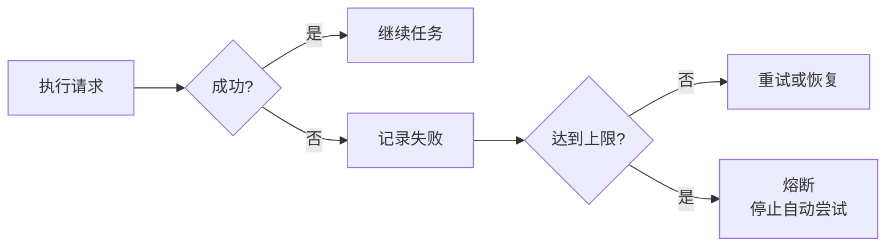
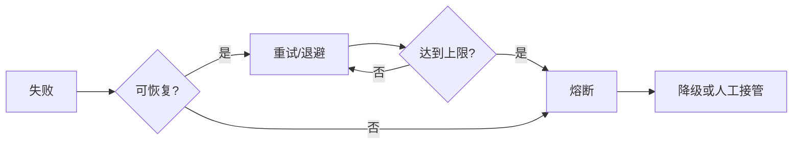

# Circuit Breaker 熔断器机制

**Circuit Breaker（熔断器）** 在 Agent系统里，指的是一种**保护性停止机制**：当某个自动恢复路径连续失败、重试已经没有收益时，系统主动停止继续尝试，避免无限消耗 token、大模型API配额和执行时间。

一句话理解：**熔断器不是修复错误，而是阻止错误被无限放大。**

在 Claude Code 这类 Agent Loop（智能体循环）里，模型会反复经历
"准备上下文 → 调模型 → 执行工具 → 写回工具结果 → 再调模型"
如果 compact（上下文压缩）、模型调用、工具执行或错误恢复没有边界，Agent 很容易在一个失败路径里一直转圈。

------

## 一、为什么 Agent 需要熔断器

Agent 的危险点在于它会自动继续。一次失败如果没有边界，可能变成一串失败。

- `prompt_too_long`（提示词过长）后，系统尝试 reactive compact（响应式压缩）。
- reactive compact 后仍然超限，系统继续 compact。
- 继续失败后又继续 compact。
- 用户没有得到结果，但请求、时间、token 都在消耗。

熔断器要做的事很简单：**失败可以重试，但不能无限重试。**

这里的关键不是"失败一次就停"，而是**累计失败证据**。只有当系统判断继续尝试收益很低时，才进入熔断。

------

## 二、真实对话：没有熔断器会怎样

用户：帮我读完整个项目，然后总结架构。

Agent：我先读取项目文件。

系统：Agent 连续读取大量文件，`messages`（消息列表，保存用户、助手和工具结果的历史记录）迅速膨胀。

Agent：准备调用模型总结。

API：`prompt_too_long`。

Agent：我做一次 reactive compact，然后重试。

API：还是 `prompt_too_long`。

如果没有熔断器，后面可能变成这样：

- Agent：我再 compact 一次。
- API：还是 `prompt_too_long`。
- Agent：我再 compact 一次。
- API：还是 `prompt_too_long`。
- Agent：我再 compact 一次。
- API：还是 `prompt_too_long`。

这时系统没有产出任何有效结果，只是在同一个错误上反复消耗资源。带熔断器的处理应该是：

Agent：已经执行过 reactive compact，重试后仍然超限。自动恢复失败，停止继续重试。建议缩小读取范围，或按目录分批总结。

**关键理解：熔断器保护的不是某一次请求，而是整个 Agent 循环。**

------

## 三、Claude Code compact 里的熔断场景

在 Claude Code Context Compact（上下文压缩）里，熔断器最典型的场景是 auto compact（自动压缩）连续失败。

用户：把 `src/` 下所有文件都读完，找出认证逻辑的问题。

Agent：开始读取文件。

系统：工具结果持续进入 `messages`，依次执行：

- `tool_result_budget`（工具结果预算，把大输出落盘）
- `snip_compact`（中段裁剪）
- `micro_compact`（微压缩）

系统：上下文仍然超过阈值，触发 auto compact。

Agent：保存 transcript（完整对话归档），调用 LLM（Large Language Model，大语言模型）生成 summary（摘要）。

API：摘要请求失败。

系统：记录 auto compact 失败 1 次。

下一轮又失败，记录第 2 次。再下一轮仍失败，记录第 3 次。

熔断器触发：**连续失败 3 次后，停止继续 auto compact**，避免摘要请求在同一个失败路径里反复消耗 API 调用。

这里的重点不是"3"这个数字，而是**连续失败阈值**。它表达的是一个工程判断：同一类自动恢复连续失败多次，就不要假设下一次一定会成功。

------

## 四、熔断器和重试的关系

Retry（重试）和 Circuit Breaker（熔断器）经常一起出现，但它们的职责不同。

- **重试**：给暂时性错误一次恢复机会。比如网络抖动、429 rate limit（请求被限流）、529 overloaded（服务过载）。
- **退避**：重试前先等待，常见做法是 exponential backoff（指数退避，失败后等待时间逐步变长）加 jitter（随机抖动，避免大量请求同时重试）。
- **熔断**：当重试或恢复达到上限，停止自动继续。
- **降级**：熔断后换策略，比如缩小任务范围、切换模型、保存现场、请求用户决策。

可以这样理解：**重试负责给机会，退避负责别添堵，熔断负责踩刹车，降级负责换路线。**

没有重试，系统太脆；没有熔断，系统太莽。

------

## 五、Agent 系统里常见的熔断类型

熔断器的分类不必脱离 Agent 场景去讲。对 Claude Code 这类系统来说，最常见的是下面几种。

| 类型 | 触发条件 | Agent 场景 |
| --- | --- | --- |
| **连续失败熔断** | 同一恢复动作连续失败 N 次 | auto compact 连续失败 3 次后停止 |
| **重试上限熔断** | 同一请求重试达到上限 | reactive compact 后仍然 `prompt_too_long` |
| **token 预算熔断** | 上下文或输出预算持续超限 | 大量文件读取后拒绝继续塞入上下文 |
| **工具执行熔断** | 工具多次失败、超时或输出异常 | bash 命令反复失败后停止自动执行 |
| **模型输出熔断** | `max_tokens`（最大输出 token 数）多次截断 | continuation prompt（续写提示）达到上限后停止 |
| **服务错误熔断** | 429 / 529 多次出现 | 重试退避后仍失败，停止继续打 API |
| **权限风险熔断** | 操作风险超过自动执行边界 | 删除、覆盖、发布等动作要求用户确认 |
| **成本熔断** | token、费用、时间超过预算 | 长任务自动拆分或要求缩小范围 |

这些类型可以组合。例如一次长任务可能同时触发 token 预算、compact 失败上限、API 退避和工具执行熔断。

------

## 六、熔断器通常需要哪些参数

设计熔断器时，不能只写"失败就停"。要把触发、等待、恢复和降级都定义清楚。

- **失败阈值**：失败多少次触发熔断，例如连续 3 次 auto compact 失败。
- **时间窗口**：在多长时间内统计失败，例如 1 分钟内多次 529。
- **重试上限**：最多允许自动尝试几次，例如 reactive compact 只尝试一次。
- **冷却时间**：熔断后等待多久再试探恢复。
- **试探请求**：恢复前先放少量请求验证是否正常。
- **降级策略**：熔断后怎么处理，例如返回错误、缩小范围、切换模型、保存现场、交给用户判断。
- **恢复条件**：什么情况下清空失败计数，回到正常流程。

对 Agent 来说，最重要的是**降级策略**。熔断后不一定只是报错，也可以转成更小、更稳的任务。

例如：

- 原任务：读完整个项目并总结。
- 熔断后：先只总结 `src/auth/`。
- 原任务：继续 reactive compact。
- 熔断后：要求用户选择"分批读取"或"只保留最近上下文"。
- 原任务：继续调用失败模型。
- 熔断后：切换 fallback model（备用模型）或暂停等待。

------

## 七、最终理解

熔断器是一种**边界机制**。它不负责把错误变成功，它负责在自动恢复失效时停止损耗。

在 Agent 系统里，它回答的是这个问题：当压缩、重试、退避、续写、切换模型都没能解决问题时，系统什么时候应该停下来？

答案不是"永远继续"，而是：

- 到达阈值就停止。
- 保留现场。
- 换更小的任务、更稳的模型或让用户决策。

这就是熔断器的价值：**让自动化有边界，让失败可控。**