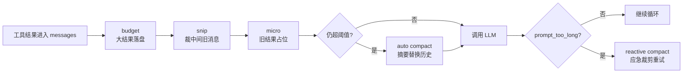

# Claude Code Context Compact 上下文压缩机制

Claude Code 的 **Context Compact（上下文压缩）**，解决的是一个很现实的问题：Agent工作越久，Context Window越容易被塞满。

在一个agent里，模型不是只看用户的一句话。它还要看 `messages`（消息列表，保存用户、助手和工具结果的历史记录）、文件内容、命令输出、TODO（待办事项）、工具调用结果和系统约束。

读几个大文件、跑几十条命令之后，token很快就会膨胀。超过上限时，大模型API会拒绝请求，常见错误是 `prompt_too_long`（提示词过长）。

**核心思想：便宜的先做，贵的后做。** 能用结构化裁剪解决，就不要先调用模型；只有普通裁剪不够时，才让 LLM生成摘要。

------

## 一、Compact 在 Agent Loop 里的位置

Agent Loop（智能体循环）可以理解为：

- 准备上下文 → 调模型 → 执行工具 → 把工具结果写回上下文 → 再调模型。

Context Compact 插在每次调模型之前，也会在请求失败后进入应急路径。

图里的 budget（预算控制）负责处理大输出，snip（裁剪）负责裁掉中间旧消息，micro（微压缩）负责把旧工具结果变成占位符，auto compact（自动压缩）负责提取摘要，reactive compact（响应式压缩）负责报错后补救。

这张图的重点不是 L1、L2、L3 的编号，而是**真实执行顺序**：先处理大工具结果，再裁消息，再压旧结果，最后才考虑模型摘要。

------

## 二、为什么需要压缩

Claude Code 的上下文不是"聊天记录"那么简单，而是工作现场。一次 `read_file` 可能把几千行代码放进 `messages`；一次 `bash` 可能返回几万字符日志；一次子任务可能追加多轮工具结果。

如果不压缩，旧信息会产生两个问题。

- 第一是**硬限制**：上下文超过窗口，大模型API 直接拒绝。

- 第二是**软污染**：旧目标、旧输出和旧文件内容还在上下文里，模型更容易被噪声带偏。

所以 compact 的目标不是单纯省 token，而是保持一个**可继续工作的最小现场**：当前目标、关键发现、已修改文件、剩余任务、用户约束必须留下；过期日志、重复输出、大段旧文件内容可以被替换、落盘或摘要。

------

## 三、四层压缩管线

教学版把压缩拆成四层：`tool_result_budget`（工具结果预算）、`snip_compact`（中段裁剪）、`micro_compact`（微压缩）、`compact_history`（历史摘要）。其中前三层不调用模型，第四层调用模型生成摘要。

| 层级 | 名称                   | 作用                                                         | 成本         |
| ---- | ---------------------- | ------------------------------------------------------------ | ------------ |
| L3   | **tool_result_budget** | 把过大的 `tool_result`（工具返回结果）写入磁盘，上下文只留路径和预览 | 0 次模型调用 |
| L1   | **snip_compact**       | 消息太多时保留开头(更容易包含项目完整架构、全局信息)和结尾(近几十条，包含最新的任务信息)，裁掉中间旧消息 | 0 次模型调用 |
| L2   | **micro_compact**      | 更旧的工具结果替换成占位符，只保留最近结果                   | 0 次模型调用 |
| L4   | **compact_history**    | 保存完整历史，让模型生成摘要，用摘要替换旧上下文             | 1 次模型调用 |

这里有个容易误解的点：编号是讲解顺序，执行时 **L3 在 L1、L2 前面**。原因很简单，`micro_compact` 会把旧工具结果换成占位符，如果先通过`micro_compact`占位，原始tool_result就没办法写入磁盘了。

------

## 四、L3：tool_result_budget，长文本结果优先存磁盘

`tool_result_budget` 的作用是处理"单次工具结果太大"。例如模型一次读取多个大文件，最后一条 user（用户角色）消息里所有 `tool_result` 加起来超过token的context window，系统会从最大的结果开始处理。

处理方式不是直接丢弃，而是写入 `.task_outputs/tool-results/`，上下文中留下 `<persisted-output>`（已持久化输出标记）和前 2000 字符预览。这样模型知道完整内容还在磁盘里，必要时可以重新读取。

**关键理解：不是摘要，是搬家。** 它从活跃上下文搬到磁盘，避免一个工具输出直接撑爆窗口。

------

## 五、L1：snip_compact，裁掉中间旧消息

`snip_compact` 处理的是"消息数量太多"。

简单策略是：超过 50 条消息时，保留头部 3 条和尾部 47 条，中间用一条占位消息替代。

头部通常包含最初目标，尾部通常包含当前工作现场，中间历史则最容易过期。这个策略不理解语义，但便宜、稳定、速度快。

**关键理解：snip 是按位置裁剪，不是按重要性理解。** 它适合先做粗清理，不能替代真正的摘要。

------

## 六、L2：micro_compact，旧工具结果占位

`micro_compact` 处理的是"旧工具结果还在占空间"。

简单策略：只保留最近 3 条工具结果，更早的长内容会被替换成类似"Earlier tool result compacted"的占位文本。

这层特别适合处理连续读文件、连续跑命令的场景。模型通常只需要最近几次工具结果来决定下一步，十几轮前的完整输出留在上下文里，价值很低。

**关键理解：micro 是把旧结果变成提醒。** 它告诉模型"这里曾经有结果，但现在不在活跃上下文里了，需要就重读"。

------

## 七、L4：compact_history，真正的历史摘要

前三层都是机械压缩，不理解任务语义。如果压完以后仍然超过阈值，就进入 `compact_history`。

`compact_history` 会先写入 transcript（完整对话归档，通常是 JSONL：每行一个 JSON 对象的日志格式），再调用 LLM 生成 摘要，最后用一条 `[Compacted]` 消息替换旧历史。

摘要必须保留的是**当前目标**、**关键发现**、**已读文件**、**已改文件**、**剩余工作**、**用户约束**。

真实 Claude Code 会在压缩后恢复部分最近文件、计划、工具和 agent 上下文，所以连续工作的体验更好。

**关键理解：compact_history 是语义压缩。** 它会丢失细节，但能保留任务方向。

------

## 八、Auto Compact 和 Reactive Compact 的区别

Auto Compact（自动压缩）是请求发出前的主动压缩。每轮调用模型前，系统估算上下文是否超阈值；如果超了，就执行 `compact_history`。它是常规续航机制。

Reactive Compact（响应式压缩）是请求失败后的应急压缩。只有 API 已经返回 `prompt_too_long` 或类似错误时才触发。它同样会保存 transcript 并生成摘要，但裁剪更激进，然后重试。

| 维度     | Auto Compact       | Reactive Compact       |
| -------- | ------------------ | ---------------------- |
| 触发时机 | 调模型之前         | API 报错之后           |
| 目标     | 提前避免上下文爆掉 | 把失败请求救回来       |
| 策略     | 摘要替换历史       | 摘要加尾部少量消息     |
| 频率     | 长任务中的正常机制 | 极端情况的兜底机制     |
| 风险     | 摘要可能漏细节     | 裁剪更狠，细节损失更大 |

**一句话区分：Auto Compact 是"快满了先整理"，Reactive Compact 是"已经炸了先抢救"。**

**Auto compact**（包含前面的L1-L4）是在对话之前、调用大模型之前，把context压缩到一定范围内，确保API调用不会报错。

但也偶尔会有意外发生，这时就需要**Reactive compact**，是一种兜底机制。

------

## 九、compact 工具和手动压缩

cc新增了 `compact` 工具。模型主动调用它时，不是返回一句"已压缩"的空结果，而是真的触发 `compact_history`，然后结束当前 turn（轮次），用压缩后的上下文开启下一轮。

这和用户手动 `/compact` 的思路接近：不是等上下文报错，而是在还能正常工作时主动整理历史。

**适合主动 compact 的场景** 是目标已经阶段性完成、上下文很长、接下来要切换到新阶段。比如"已经读完项目结构，接下来开始改代码"，这时先压缩能让后续推理更干净。

------

## 十、压缩不是万能记忆

Compact 会让 Agent 跑得更久，但它不是完整记忆系统。摘要一定会损失细节，尤其是旧工具输出、旧文件片段、早期推理分支。

因此重要信息不能只放在上下文里。真正需要长期保留的内容，应该进入代码、文档、TODO、计划、memory（记忆系统）或 transcript。

------

## 十一、最终理解

Context Compact 是 Claude Code 能长期工作的基础设施。它不追求把所有历史都记住，而是持续维护一个适合下一步行动的上下文现场。

**tool_result_budget** 解决"大输出太大"。**snip_compact** 解决"消息太多"。**micro_compact** 解决"旧结果太占"。**compact_history** 解决"机械裁剪仍不够"。**reactive_compact** 解决"请求已经失败"。